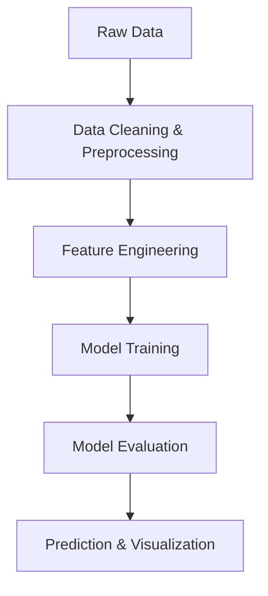

# House Price Prediction Project

## Project Overview

This project predicts **house prices** in Bangalore based on features such as **location, total square feet area, number of BHKs (bedrooms), and price per square foot**. The model is trained on cleaned real estate data and can estimate house prices for new inputs.

---

## Features Used

* `location` – Area/locality of the property
* `total_sqft` – Total square feet area of the house
* `BHK` – Number of bedrooms
* `price_per_sqft` – Price per square foot (derived feature)

Other features dropped for simplicity:

* `area_type`
* `society`
* `balcony`
* `availability`

---

## Data Cleaning & Preprocessing

1. Converted `total_sqft` to numeric values (handled ranges like `2100-2850`).
2. Removed extreme outliers in `price_per_sqft` per location using **mean ± std**.
3. Replaced low-frequency locations (less than 10 data points) with `"other"`.
4. Removed invalid entries where `total_sqft / BHK < 300` sqft.

---

## Model

* **Model Type:** Linear Regression 
* **Trained on:** Cleaned dataset (`data10`)
* **Saved as:** `House_price_prediction_model.pkl` (Pickle file)

The model predicts **house price** given input features like location, BHK, and total square feet.

---

## How to Use

```python
import pickle
import pandas as pd

# Load the trained model
with open("House_price_prediction.pkl", "rb") as f:
    model = pickle.load(f)

# Example input (ensure preprocessing matches training)
X_test = pd.DataFrame({
    'location': ['Rajaji Nagar'],
    'total_sqft': [1200],
    'BHK': [2]
})

# Predict house price
y_pred = model.predict(X_test)
print("Predicted Price:", y_pred)
```

---

## Visualizations

The project includes scatter plots to **compare prices of 2BHK and 3BHK homes** in a specific location:

```python
plot_scatter_chart(data10, "Rajaji Nagar")
```

* Blue dots → 2 BHK
* Green `+` → 3 BHK
* Helps identify trends and outliers visually.

---

## Requirements

* Python 3.x
* pandas
* numpy
* matplotlib
* scikit-learn

---

## Project Flow Diagram


